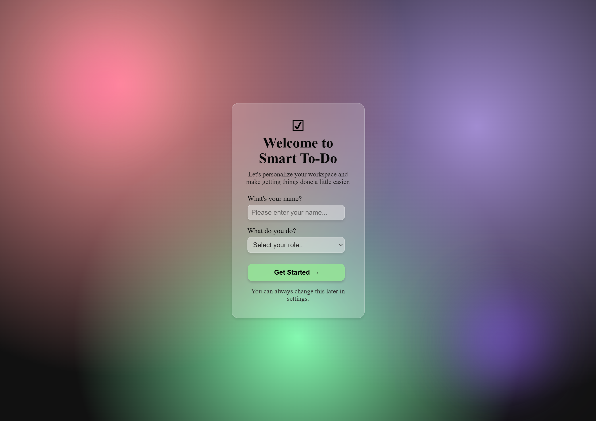

# Smart To-Do

Smart To-Do is a personalized task management web application designed to help users organize and manage their daily tasks more effectively.

The project is currently under development. This stage focuses on the user onboarding experience and the foundation for the main To-Do dashboard.

## Current Features

* User onboarding form
* Collects the user's name
* Collects the user's occupation
* Form validation using HTML
* Saves user information to `localStorage`
* Converts user information into JSON before storing it
* Resets the form after submission
* Automatically navigates the user to the Smart To-Do page
* Glassmorphism-style interface
* Animated colorful background glows
* Hover effects on form controls and the Get Started button

## Technologies Used

* HTML5
* CSS3
* JavaScript
* Browser Local Storage
* JSON

## Project Structure

```text
Smart-To-Do/
│
├── README.md
├── form.png
├── index.html
├── todo.html
├── style.css
└── functionality.js
```
## First Visit Page


## How It Works

When a user visits the application, they are welcomed with an onboarding form.

The user provides:

1. Their name
2. Their occupation

When the user clicks **Get Started**, JavaScript:

1. Prevents the form's default submission behavior.
2. Retrieves the user's input.
3. Creates an object containing the user's information.
4. Converts the object into a JSON string.
5. Stores the JSON data in `localStorage`.
6. Resets the form.
7. Redirects the user to the Smart To-Do page.

## Data Storage

User information is currently stored in the browser's `localStorage` using the key:

```text
userInfo
```

The stored data follows this structure:

```json
{
  "username": "User Name",
  "useroccupation": "student"
}
```

This information will later be retrieved by the Smart To-Do dashboard to personalize the user's experience.

## Current Progress

* [x] Create onboarding form
* [x] Style onboarding page
* [x] Add glassmorphism effect
* [x] Add animated background glows
* [x] Add form interactions
* [x] Capture user information with JavaScript
* [x] Store user information in `localStorage`
* [x] Convert user data to JSON
* [x] Reset form after submission
* [x] Navigate to the To-Do page
* [ ] Build Smart To-Do dashboard
* [ ] Retrieve and display user information
* [ ] Add task creation
* [ ] Add task completion
* [ ] Add task deletion
* [ ] Add task persistence
* [ ] Add responsive design
* [ ] Add additional dashboard features

## Future Plans

The next stage of development will focus on building the main Smart To-Do dashboard and using the stored user information to create a personalized experience.

Planned features include task management, dashboard statistics, navigation, user settings, and additional productivity features.

## Author

**Ama Baidoo-Mensah**

This project is being developed as part of my frontend development practice and portfolio projects.
