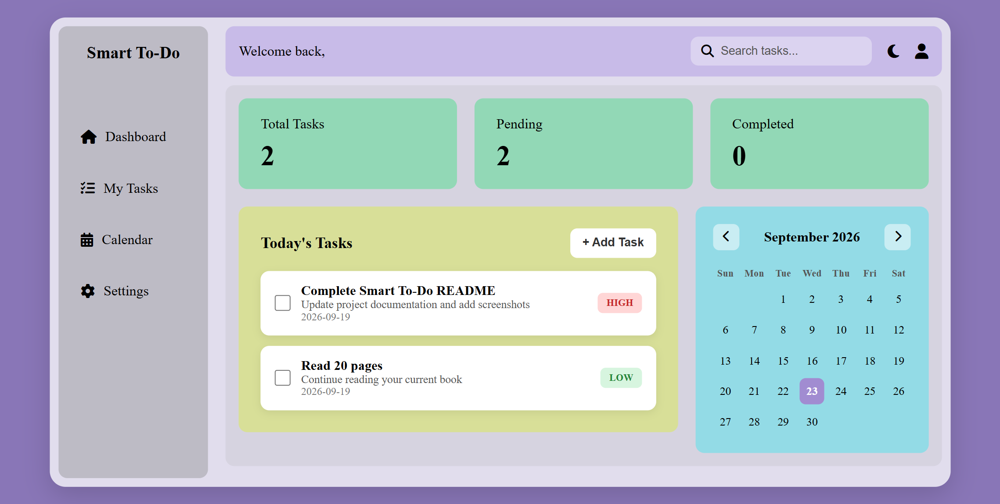
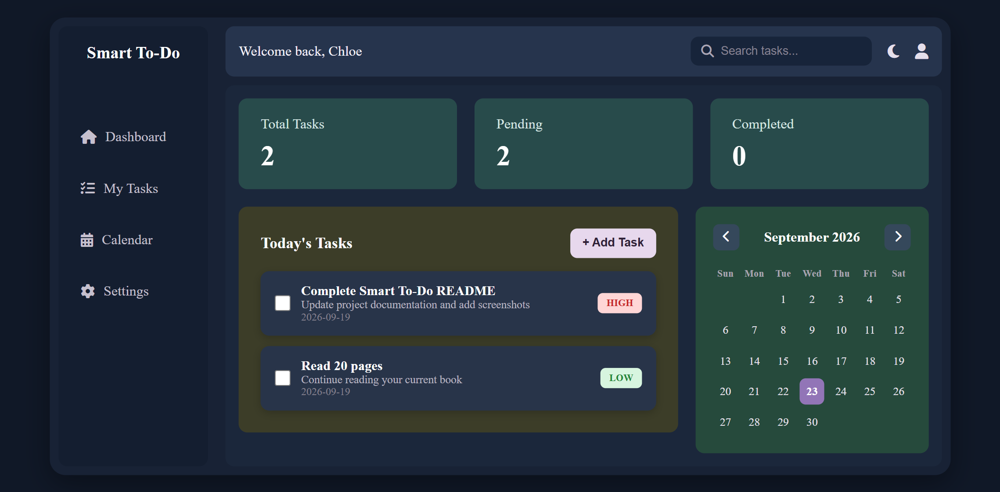
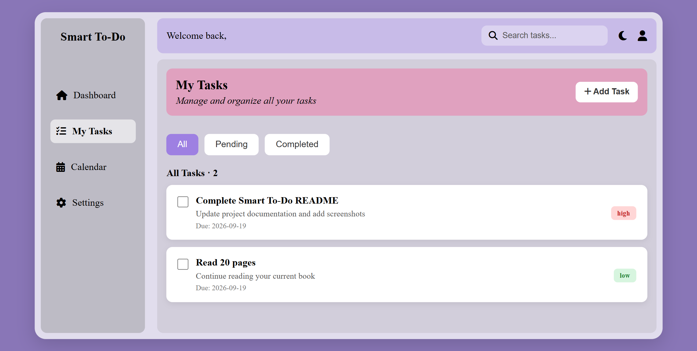
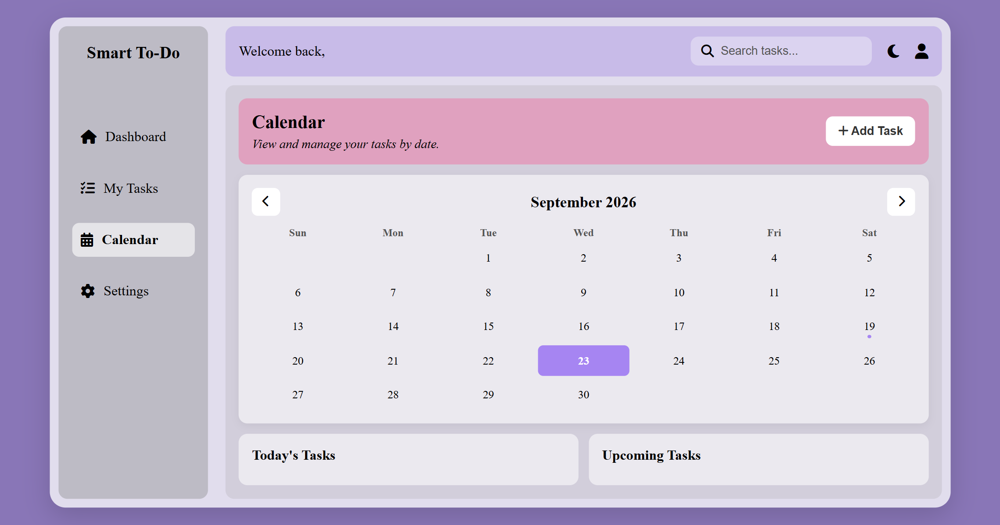
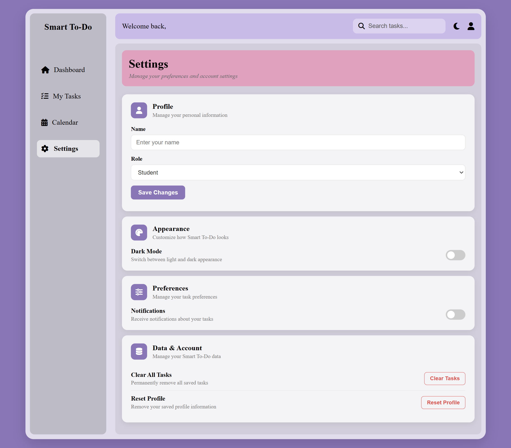

# Smart To-Do

Smart To-Do is a personalized task management web application designed to help users organize, manage, and track their daily tasks more effectively.

The application allows users to create and manage tasks, monitor their progress, view tasks on a calendar, personalize their profile, and switch between light and dark modes.

## Features

### User Onboarding

* User onboarding form
* Collects the user's name
* Collects the user's occupation
* Form validation using HTML
* Saves user information to `localStorage`
* Converts user information into JSON before storing it
* Automatically navigates the user to the dashboard

### Dashboard

* Personalized welcome message
* Displays total tasks
* Displays pending tasks
* Displays completed tasks
* Displays saved tasks
* Task priority indicators
* Mark tasks as completed
* Persistent task data using `localStorage`

### Task Management

* Create new tasks
* Add task title
* Add task description
* Set task due date
* Set task priority
* Mark tasks as completed
* Filter tasks by:

  * All
  * Pending
  * Completed
* Task information is saved in `localStorage`

### Calendar

* Monthly calendar view
* Navigate between months
* Displays tasks according to their due dates
* Highlights dates containing tasks
* Highlights the current date
* Displays tasks for a selected date
* Add tasks to Google Calendar

### Settings

* Update user name
* Update user occupation
* Save profile changes
* Dark mode toggle
* Persistent dark mode preference
* Notification preference
* Clear all saved tasks
* Reset profile information

### Interface

* Glassmorphism-inspired design
* Colorful visual elements
* Hover effects
* Interactive buttons and controls
* Dark mode styling
* Consistent navigation across pages

## Technologies Used

* HTML5
* CSS3
* JavaScript
* Font Awesome
* Browser Local Storage API
* JSON
* Google Calendar URL integration

## Project Structure

```text
Smart-To-Do/
│
├── README.md
├── screenshots/
│   └── form.png
│
├── dashboard.html
├── my-tasks.html
├── calendar.html
├── settings.html
│
├── to-do.css
└── functionality.js
```

## Screenshots

### First Visit Page


### Dashboard



### My Tasks



### Calendar



### Settings



## How It Works

When a user first visits the application, they are welcomed with an onboarding form.

The user provides:

1. Their name
2. Their occupation

When the user clicks **Get Started**, JavaScript:

1. Prevents the form's default submission.
2. Retrieves the user's input.
3. Creates an object containing the user's information.
4. Converts the object into a JSON string.
5. Stores the data in `localStorage`.
6. Redirects the user to the dashboard.

After onboarding, the user can create and manage tasks from the dashboard.

Tasks are stored in `localStorage`, allowing them to remain available when the user navigates between the different pages.

## Data Storage

Smart To-Do currently uses the browser's `localStorage` to store user information, tasks, and preferences.

### User Information

User information is stored using the key:

```text
userInfo
```

Example:

```json
{
  "username": "User Name",
  "useroccupation": "student"
}
```

### Tasks

Task information is stored using the key:

```text
taskInfo
```

Each task contains information such as:

```json
{
  "taskTitle": "Complete project",
  "taskDescription": "Finish the Smart To-Do project",
  "taskDate": "2026-09-20",
  "taskPriority": "high",
  "completed": false
}
```

### Preferences

The application also stores user preferences such as:

* Theme preference
* Notification preference

## Current Progress

* [x] Create onboarding form
* [x] Style onboarding page
* [x] Add glassmorphism effect
* [x] Add animated background glows
* [x] Add form interactions
* [x] Capture user information with JavaScript
* [x] Store user information in `localStorage`
* [x] Convert user data to JSON
* [x] Navigate to the dashboard
* [x] Build dashboard
* [x] Add task creation
* [x] Add task completion
* [x] Add task persistence
* [x] Add task filtering
* [x] Add task statistics
* [x] Build My Tasks page
* [x] Build Calendar page
* [x] Add calendar task display
* [x] Add Google Calendar integration
* [x] Build Settings page
* [x] Add profile management
* [x] Add dark mode
* [x] Add notification preference
* [x] Add task clearing
* [x] Add profile reset
* [x] Add persistent user preferences
* [x] Improve responsive design
* [ ] Perform final testing
* [ ] Deploy the application

## Future Plans

Future improvements may include:

* Task editing
* More advanced notifications
* User authentication
* Backend and database integration
* Cloud data synchronization
* Recurring tasks
* Improved mobile responsiveness
* Additional productivity features

## Author

**Ama Baidoo-Mensah**

This project is being developed as part of my frontend development practice and portfolio projects.
